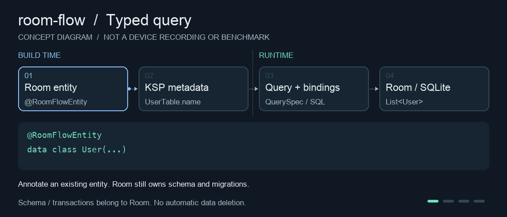
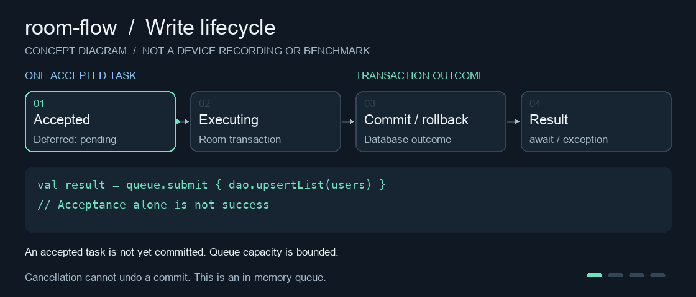

# room-flow

**在已有 Room 数据库上，补齐类型安全查询、可观察数据流和可控写入。**

Android / Kotlin · Room 2 · OpenHelper · minSdk 24

room-flow 是 Room 的扩展 SDK，不是新的数据库引擎。保留你的 Entity、DAO、RoomDatabase 和 Migration，按需使用查询构造、写队列、分页、维护及诊断能力；不要求替换已有数据层。

> 当前发布目标为 `0.2.0-rc.1` 预发布版，使用 JitPack 多模块坐标。Tag/制品发布不等于商用验收完成；远端构建状态见 [JitPack](https://jitpack.io/#kairowan/room-flow/0.2.0-rc.1)，支持范围与未关闭门槛见 [版本与验证](#verification) 及 [发布清单](docs/RELEASE-CHECKLIST.md)。

[功能总览](#features) · [快速接入](#setup) · [类型安全 CRUD](#typed) · [SQL / Flow / 分页](#queries) · [事务与队列](#writes) · [备份与迁移](#safety) · [维护与诊断](#operations) · [二次封装](#extension)

<a id="features"></a>

## 功能总览

| 能力 | 已有 API / 实现方式 | 适用场景 |
| --- | --- | --- |
| 类型安全 CRUD | `@RoomFlowEntity` + KSP 生成 `XxxTable`；字段带实体类型和值类型 | 避免字段拼错、跨实体条件和错误赋值 |
| 可复用查询 | 不可变 `QuerySpec`，组合条件、排序、分页、单行及计数 | 统一业务查询、Repository 二次封装 |
| DTO 与统计 | `projection`、`pageResult`、`aggregate`、`groupBy` | 只读需要的列、同快照页数据/总数、单键统计 |
| 原生 SQL 与导出 | 参数绑定、`rawQueryList`、`rawQueryEach`、Cursor 映射、部分更新 | 复杂 SQL、可取消查询、逐行导出 |
| 响应式查询 | Room `InvalidationTracker` + 冷 Flow + 串行重查 | 表变化后更新查询结果 |
| 两种分页 | OFFSET/Paging 3、`seekAfter` 多字段游标 | 列表分页或稳定排序的顺序翻页 |
| 事务与重试 | Room `withTransaction` + busy/locked 重试 | 多步写入的原子性 |
| 有界写队列 | `WriteQueue`，串行事务、批量提交、暂存合并、排空/关闭 | 控制显式提交的并发写入 |
| 离线备份与恢复 | 临时副本校验、清单/SHA-256、恢复前保留恢复点 | 已停写、已关闭连接的普通 SQLite 文件 |
| 迁移建议 | 比较 Room schema JSON，只生成受支持变更的 SQL 建议 | 辅助新增表/列，不替代 Migration |
| 维护与观测 | integrity check、WAL checkpoint、指标快照、安全日志 | 排查问题、显式执行维护 |
| 可选扩展 | Debug 面板、多库路由、跨进程通知桥接、外部加密工厂 | 宿主按需接线，不自动接管业务 |

实现入口在 [room-flow/src/main](room-flow/src/main/java/com/kairowan/room_flow)、[KSP 处理器](room-flow-compiler/src/main/kotlin/com/kairowan/room_flow/compiler/RoomFlowProcessor.kt) 和 [可选调试模块](room-flow-debug/src/main)。

<a id="setup"></a>

## 快速接入

### 1. 选择模块

| 模块 | 是否必需 | 作用 |
| --- | --- | --- |
| `room-flow` | 是 | 核心扩展，不依赖调试 UI |
| `room-flow-compiler` | 仅 typed CRUD 需要 | KSP 编译期生成字段和映射，不进入 APK |
| `room-flow-debug` | 否 | Debug 面板，只放 `debugImplementation` |
| `app` | 否 | 本仓库示例，不是 SDK 依赖 |

外部项目在 `settings.gradle.kts` 添加仓库，仅允许它解析本 SDK 的 group：

```kotlin
dependencyResolutionManagement {
    repositories {
        google()
        mavenCentral()
        maven("https://jitpack.io") {
            content { includeGroup("com.github.kairowan.room-flow") }
        }
    }
}
```

在应用模块中按需添加：

```kotlin
dependencies {
    implementation("com.github.kairowan.room-flow:room-flow:0.2.0-rc.1")
    // 仅需要类型安全实体 CRUD 时添加，宿主需已启用匹配版本的 KSP 插件。
    ksp("com.github.kairowan.room-flow:room-flow-compiler:0.2.0-rc.1")
    // 仅需要 Debug 面板时添加。
    debugImplementation("com.github.kairowan.room-flow:room-flow-debug:0.2.0-rc.1")
}
```

三个模块使用同一个 tag 版本。**不要使用聚合坐标 `com.github.kairowan:room-flow:0.2.0-rc.1`**，它可能把 Debug 模块和构建期处理器一起引入；多模块规则见 [JitPack 文档](https://docs.jitpack.io/building/#multi-module-projects)。首次解析会触发远端构建，依赖可用性以构建状态和实际下载为准。

发布制品基于 Room 2.6.1，宿主可以对齐到已验证的 2.8.4；runtime/compiler/KSP 模式须一致。升级自 0.1.0 需重新编译，检查 [API 迁移说明](docs/API-CONTRACTS.md)。详细发布与本地 Maven 包引入见 [发布说明](docs/PUBLISHING.md)。

以下是**在本仓库中运行示例**的本地模块方式：

```kotlin
// app/build.gradle.kts
plugins {
    alias(libs.plugins.android.application)
    alias(libs.plugins.kotlin.android)
    alias(libs.plugins.ksp)
}

dependencies {
    implementation(project(":room-flow"))
    ksp(project(":room-flow-compiler")) // 不使用 typed API 可省略。
    ksp("androidx.room:room-compiler:2.6.1")
    debugImplementation(project(":room-flow-debug")) // 可选。
}
```

保留宿主已有 Room compiler 和 KSP 配置，避免重复添加处理器。Room runtime/compiler 应对齐；切换 Room 版本时一起调整，不能只改上述 compiler 字符串。完整配置见 [app/build.gradle.kts](app/build.gradle.kts)。

### 2. 复用已有数据库

- 继续使用原来的 `RoomDatabase` 实例、文件名/路径、版本、转换器、回调和 OpenHelper 工厂。
- 只接入 SDK、schema 不变时，**不需要迁移、复制数据或增加数据库版本**。
- 不要为了接入启用 `fallbackToDestructiveMigration`。真实结构变更仍由宿主的 Migration / AutoMigration 负责。
- SDK 不拦截所有 DAO；原 DAO 不会自动进入写队列或全部被指标统计。

下文 `db` 指宿主已有的 RoomDatabase，`User` / `UserTable` 来自示例实体；挂起调用放在协程中。代码块中的类分别放入同名文件，不合并类和接口。

### 3. 给现有实体增加可选注解

```kotlin
// User.kt
import androidx.room.Entity
import androidx.room.PrimaryKey
import com.kairowan.room_flow.typed.RoomFlowEntity

@Entity(tableName = "users")
@RoomFlowEntity
data class User(
    @PrimaryKey(autoGenerate = true) val id: Long = 0,
    val name: String,
    val age: Int?,
    val sex: String,
    val lastActive: Long = System.currentTimeMillis()
)
```

Room 仍负责建表、DAO 和迁移。KSP 在 `app/build/generated/ksp/<variant>/kotlin/` 下生成同包的 `UserTable.kt`；不要手写或修改该文件。隔离构建时，文件位于该次构建的输出目录。

<a id="typed"></a>

## 类型安全 CRUD

### 实现流程



*功能原理动画，不是真机录屏、不展示性能数据；播放两轮后停止。[静态版](docs/assets/typed-query.png)。*

**编译期生成的是字段元数据和映射代码，不是所有查询的 SQL。** 调用 `where/page` 等方法时在运行期组合参数化 SQL；`list/execute` 等终结操作才访问数据库。

`UserTable.name` 保留 `String` 类型；不存在的字段没有生成引用，其他实体的条件不能直接用于 User。`@ColumnInfo` 重命名会映射到真实列名。执行入口还会检查目标表的字段类型、可空性和主键；不匹配就失败，不自动改库。

### 查询、不分页与分页

```kotlin
import com.kairowan.room_flow.typed.contains
import com.kairowan.room_flow.typed.select

// 不调用 page 就不加 LIMIT；大结果不宜一次加载进内存。
val users: List<User> = db.select(UserTable)
    .where(UserTable.age.greaterThanOrEqual(18))
    .orderBy(UserTable.id.desc())
    .list()

val page: List<User> = db.select(UserTable)
    .where(UserTable.name.contains("张%")) // % 按字面字符查询。
    .orderBy(UserTable.id.desc())
    .page(1, 20)
    .list()

val first: User? = db.select(UserTable).firstOrNull()
val exists: Boolean = db.select(UserTable).where(UserTable.id.eq(1L)).exists()
val names: List<String> = db.select(UserTable).values(UserTable.name)
```

`page` 从 1 开始，页大小为 1..500；默认主键排序，自定义排序后会补齐主键。`count()` 统计当前窗口，`totalCount()` 忽略分页。大结果可用 `each { user -> … }` 逐行消费，不自动重试。

### 新增、修改与删除

```kotlin
import com.kairowan.room_flow.typed.delete
import com.kairowan.room_flow.typed.insert
import com.kairowan.room_flow.typed.update

val id = db.insert(UserTable, User(name = "张三", age = 20, sex = "男"))

val changed = db.update(UserTable)
    .set(UserTable.name, "李四")
    .set(UserTable.age, null)
    .where(UserTable.id.eq(id))
    .execute(maxAffectedRows = 1)

val deleted = db.delete(UserTable)
    .where(UserTable.id.eq(id))
    .execute(maxAffectedRows = 1)
```

- `insert` 默认 ABORT，不使用 REPLACE；返回 SQLite rowId，不修改原实体。复合主键不能将 rowId 当业务主键。
- `db.update(UserTable, user)` 按完整主键更新非主键字段；`db.delete(UserTable, user)` 按完整主键删除。不存在的记录返回 0。
- 部分更新禁止修改主键；缺少条件的更新/删除必须显式 `allRows()`。
- `maxAffectedRows` 超限时在同一事务抛异常并回滚，不是 SQL LIMIT。只统计直接影响行数，不限制触发器/级联行数。
- `where` 不等于防误删保证，例如 `notIn(emptyList())` 会匹配全部。无参 `execute()` 不加行数上限。

需要 upsert 时继续使用 Room `@Upsert` DAO。它更新已有行返回的 `-1` 不是原记录主键。

### DTO 投影、统计与游标

只读需要的列，不必构造缺字段的实体：

```kotlin
// UserSummary.kt
data class UserSummary(val id: Long, val name: String)
```

```kotlin
import com.kairowan.room_flow.typed.average
import com.kairowan.room_flow.typed.projection
import com.kairowan.room_flow.typed.query
import com.kairowan.room_flow.typed.select

val base = UserTable.query()
    .where(UserTable.age.greaterThanOrEqual(18))
    .orderBy(UserTable.id.desc())

val summaries = db.select(base)
    .project(projection(UserTable.id, UserTable.name, ::UserSummary))
    .pageResult(1, 20)
// summaries.items / total / page / pageSize / hasNext

val averageAge: Double? = db.select(base).aggregate(UserTable.age.average())
val bySex = db.select(base).groupBy(UserTable.sex, UserTable.age.average())

val firstPage = db.select(base.seekAfter(null, 20)).list()
val nextPage = if (firstPage.isEmpty()) emptyList() else
    db.select(base.seekAfter(firstPage.last(), 20)).list()
```

`pageResult` 在同一次 Room 事务中读取页数据与总数；不承诺跨页快照。`seekAfter` 支持多列 ASC/DESC、NULL 和完整复合主键；始终从同一个 base 派生，null 表示第一页，不要在空页后重新传 null 翻页。

统计支持 minimum/maximum、sumLong/sumDouble、average、countDistinct；分组限单键、单指标。空集/全 NULL 的平均值为 null，浮点统计不承诺金额精度，整数求和溢出明确失败。

**typed 支持范围：** 公开顶层平面 data class、常见标量及可空字段、单/复合主键、列名映射。暂不支持 Embedded、Relation、TypeConverters、FTS、泛型/继承、JOIN/HAVING 或自动 upsert；复杂 SQL 继续用 Room `@Query`。详见 [完整 typed API 与 NULL 语义](docs/TYPED-CRUD.md)。

<a id="queries"></a>

## 原生 SQL、Flow 与分页

### 原生 SQL 与统一查询文件

静态查询优先 Room `@Dao/@Query`。动态查询可以放入业务的 `XxxQueries`；字符串 SQL 不提供 typed 的编译期字段校验。

```kotlin
import com.kairowan.room_flow.sql.rawQueryList

val ids: List<Long> = db.rawQueryList(
    sql = "SELECT id FROM users WHERE age >= ? ORDER BY id",
    args = listOf(18)
) { cursor -> cursor.getLong(0) }
```

实现复用 Room 查询，事务外切 IO，事务内保持当前事务线程，并把协程取消连接到 SQLite CancellationSignal；遍历结束关闭 Cursor。参数值绑定，不拼接用户输入。字符串入口会复制 BLOB 参数；自定义 `SupportSQLiteQuery` 的绑定生命周期由提供者管理。

其他入口：

| API | 用法与资源约定 |
| --- | --- |
| `rawQuery(query)` / `rawQuery(query, signal)` | 同步返回 Cursor，在后台线程执行并用 `use` 关闭 |
| `Cursor.mapList` | 按位置映射；不替你关闭 Cursor |
| `Cursor.mapRows` / `CursorRow.get` | 按列名做运行时基本类型映射；`mapRows` 会关闭 Cursor |
| `rawQueryEach(query)` | 挂起、逐行消费，返回已消费行数，不积累全表、不自动重试 |
| `execSQL(sql, args)` | 同步写入，经过 Room 事务；调用者负责后台线程 |
| `readQuery { … }` / `write { … }` | 包装同步 DAO/写入；通用 block 不具备原生查询的强制取消能力 |

逐行导出可参考 [UserExport.kt](app/src/main/java/com/kairowan/roomflow/data/UserExport.kt)。先写临时文件，成功关闭并按业务需要 sync 后再发布；失败时不要交付部分文件。长时间读快照可能阻碍 WAL 回收。

原生部分更新也有入口：

```kotlin
import com.kairowan.room_flow.sql.update.update
import kotlinx.coroutines.Dispatchers
import kotlinx.coroutines.withContext

withContext(Dispatchers.IO) {
    db.update("users") {
        set("name" to "Alice")
        where("id = ?", 1L)
    }
}
```

这里的 WHERE 是可信 SQL，动态标识符仍需业务白名单；不要把它与 typed 字段保护混为一谈。

### 表变化后自动重查

```kotlin
import com.kairowan.room_flow.sql.rawQueryFlow

val updates = db.rawQueryFlow(
    sql = "SELECT id FROM users WHERE age >= ? ORDER BY id LIMIT 20",
    args = listOf(18),
    tables = arrayOf("users"),
    mapper = { cursor -> cursor.getLong(0) }
)
// 在页面/ViewModel 的生命周期 scope 中 collect updates。
```

typed 查询对应 `db.select(UserTable).page(1, 20).observe()`，统计对应 `observeAggregate`；已有同步查询可用 `flowQuery("users") { … }`。

底层通过 `observeTables` 注册 Room 表失效观察者，订阅先查一次，随后串行重查，取消时移除观察者。它是冷流，每个订阅者独立查询；允许合并失效事件，**不是每次写入的事件日志**。需要共享时由宿主在拥有的 scope 中使用 shareIn/stateIn，不在事务里等待 Flow。

### Paging 3

```kotlin
import androidx.sqlite.db.SimpleSQLiteQuery
import com.kairowan.room_flow.paging.pagerFromRaw

val pager = db.pagerFromRaw(
    pageSize = 20,
    tables = arrayOf("users"),
    countQuery = "SELECT COUNT(*) FROM users",
    queryProvider = { limit, offset ->
        SimpleSQLiteQuery(
            "SELECT id FROM users ORDER BY id LIMIT ? OFFSET ?",
            arrayOf(limit, offset)
        )
    },
    mapper = { cursor -> cursor.getLong(0) }
)
// pager.flow 交给宿主的 Paging UI。
```

`RawPagingSource` 将 COUNT 与页面查询放入事务快照，连接查询取消；失效后创建新 Source。COUNT 可以省略，启用占位符时必须提供，且过滤条件须与分页查询一致。带参数的 COUNT 使用 `countQueryProvider`，不能与 `countQuery` 同时指定。

核心仅依赖 paging-common；使用 RecyclerView Paging UI 的宿主自行添加 paging-runtime-ktx。OFFSET 适合常规分页；深分页可考虑 `seekAfter`，但游标也不保证并发修改下跨页不重复/遗漏。测量边界见 [性能记录](docs/PERFORMANCE.md)。

<a id="writes"></a>

## 事务与有界写队列



*功能原理动画，不代表耗时、吞吐量或真机运行结果；播放两轮后停止。[静态版](docs/assets/write-queue.png)。取消与提交可能竞争，取消不保证撤销已提交的数据。*

```kotlin
import com.kairowan.room_flow.crud.withTransactionRetry
import com.kairowan.room_flow.write.WriteQueue
import kotlinx.coroutines.NonCancellable
import kotlinx.coroutines.withContext

// dao 为宿主已有的 DAO；事务内可以调用 suspend DAO。
db.withTransactionRetry {
    dao.upsertList(users)
}

val queue = WriteQueue(db, capacity = 64)
try {
    queue.submit { dao.upsertList(users) }.await()
    // await 成功：事务已经提交，而非仅仅“已入队”。
} finally {
    withContext(NonCancellable) { queue.closeAndJoin() }
}
// 只有数据库所有者才负责最终关库。
```

**实现：** 有界 Channel 串行消费任务，每项通过 Room 协程事务执行，commit 后完成 Deferred；默认只对 busy/locked 重试整个事务。任意业务异常不是“自动修复”，取消异常也不重试。

| 操作 | 语义 |
| --- | --- |
| `submit` | 提交一个事务任务；队列满/已关闭返回失败 Deferred |
| `submitAll` | 快照输入列表，按 key 分组，在同一事务处理；默认最多 1000 项，不自动分批 |
| `coalesce` / `flushCoalesced` | 按 key 暂存，再作为一个事务提交；不是“只保留最后一项” |
| `drainAndJoin` | 拒绝新任务并等待已接收任务完成；未 flush 的暂存任务会阻止排空 |
| `close` / `closeAndJoin` | 取消任务；后者等待退出，不保证排空，不撤销已提交数据 |

重试块不放网络请求、发消息等外部副作用；队列内部不要再次入队并 await，也不要跨队列制造循环等待。它是**进程内内存队列**，不是持久化任务系统，不保证进程被杀后恢复未提交任务，也不约束绕过队列的 DAO/其他进程。

<a id="safety"></a>

## 已有数据、迁移与离线备份

### 不接管宿主迁移

`SelfHealingRoom.build` 是保留的建库入口：在后台打开，失败关闭实例并抛出异常，**不会因为打开失败自动删库**。已有项目通常继续用原 Room builder 即可。

```kotlin
import com.kairowan.room_flow.migration.MigrationAssistant

val diff = MigrationAssistant.compareSchema(db, trustedRoomSchemaJson)
val suggestedSql: List<String> = MigrationAssistant.planMigration(diff)
```

在后台线程调用，`trustedRoomSchemaJson` 来自宿主受信的 Room 导出 schema。SDK 只生成简单新增表/列建议，不自动执行 SQL；复杂主键、外键、默认值、索引、类型变化需人工 Migration。结构验证、行数或哈希相同，都不等于业务数据完整。

### 离线备份与恢复

```kotlin
import com.kairowan.room_flow.backup.BackupIdentity
import com.kairowan.room_flow.migration.MigrationAssistant
import kotlinx.coroutines.Dispatchers
import kotlinx.coroutines.withContext

// 前提：所有线程/进程停写、所有连接已关闭。
// dbFile、版本和 identityHash 来自宿主可信配置，不从待恢复清单反推。
withContext(Dispatchers.IO) {
    val identity = BackupIdentity(databaseId, schemaVersion, exportedRoomIdentityHash)
    val backup = MigrationAssistant.backupDb(dbFile, identity, databaseClosed = true)
    val preview = MigrationAssistant.previewRestore(dbFile, backup, identity, databaseClosed = true)
    // 将 preview 交给业务确认；这里不自动调用 rollbackDb。
}
```

用户确认后，由宿主在重新核对离线条件的流程中调用 `rollbackDb(dbFile, backup, identity, databaseClosed = true)`。它会再次预检并在覆盖目标前保存 `.before-restore` 恢复点；恢复后以匹配 schema 的 Room 配置重开、校验，再按需升级。

**实现与限制：**

- 备份生成主文件和 `.bak.json` 清单，校验库/账号标识、目标文件名、版本、Room identity hash 和 SHA-256。
- 校验在临时副本进行；创建文件先写临时文件、同步，再同目录 rename。备份不会被恢复操作消耗。
- 支持 `estimateBackupSpace`，以及带 Android CancellationSignal/复制进度回调的 `backupDb` 重载；空间估算不是预留，复制 100% 不等于清单发布完成。
- 仅普通 SQLite 离线文件。`databaseClosed = true` 是调用方声明，不会替你关闭连接或协调其他进程。
- 非空 WAL、残留 SHM、热/未知/不完整 journal 会拒绝；完整 28 字节零头的冷 PERSIST journal 可保留，不删除日志。
- 失败时保留原件/恢复证据，不自动覆写既有备份或恢复点。SHA-256 不认证清单真实性，不接收外部不可信备份。
- 不承诺在线备份、加密库备份、真实断电/磁盘满后的绝对完整性，也不保证任意业务迁移正确。

迁移完整性验收方法见 [已有数据库接入](docs/EXISTING-DATABASE.md)，取消、发布及恢复的详细边界见 [API 契约](docs/API-CONTRACTS.md)。

<a id="operations"></a>

## 维护、指标与 Debug 面板

### 维护入口

```kotlin
import com.kairowan.room_flow.maintenance.estimatedDbSizeBytes
import com.kairowan.room_flow.maintenance.integrityCheck

val healthy: Boolean = db.integrityCheck()
val estimatedBytes: Long = db.estimatedDbSizeBytes()
```

`analyze()` 更新统计信息，`vacuum()` 整理数据库，`walCheckpointTruncate()` 显式执行 checkpoint。大库操作可能耗时；checkpoint busy 会报告失败，返回值不能当成本次新增搬移页数。

`WalCheckpointScheduler` 根据轮询、空闲时间和 WAL 估算帧数调度 checkpoint：

```kotlin
import com.kairowan.room_flow.maintenance.checkpoint.WalCheckpointScheduler
import com.kairowan.room_flow.write.WriteQueue

val scheduler = WalCheckpointScheduler(db)
val queue = WriteQueue(db, onWriteCommitted = { scheduler.onWriteCommitted() })
scheduler.start()
// 交给数据库所有者持有；结束时停止生产者，等待 queue.closeAndJoin()，
// 再 scheduler.stopAndJoin()，最后由所有者关闭数据库。
```

所有写入方都需在 commit 后接入通知，才能解释空闲判断；WAL 帧数不等于未 checkpoint 页数。`tunePragmas` 仅是显式 synchronous=NORMAL 调优入口，断电时可能丢最近提交，不能当无代价优化。

### 查询诊断与指标

```kotlin
import com.kairowan.room_flow.metrics.RoomFlowMetrics
import com.kairowan.room_flow.sql.rawQueryList

val metrics = RoomFlowMetrics.forDatabase(db).snapshot // StateFlow<MetricsSnapshot>
val plan: List<String> = db.rawQueryList(
    "EXPLAIN QUERY PLAN SELECT id FROM users WHERE age >= ? ORDER BY id",
    listOf(18)
) { cursor -> cursor.getString(3) }
```

指标按数据库实例隔离，含队列等待/执行/拒绝、包装事务、重试和耗时；不自动覆盖全部 DAO。`transactions` 是成功的顶层包装操作数，不是数据库物理 commit 总数；详细口径见 [指标契约](docs/API-CONTRACTS.md)。

`RoomFlowConfig.onQueryObserved` 可观察 List/Flow/Each 单次游标消费的耗时、行数和状态，不含 SQL/参数；不覆盖同步 rawQuery、普通 DAO 或通用分页的直接查询。回调必须快速、不重入；生命周期结束设回 null。

### 可选 Debug UI 与日志

在 **app/src/debug** 的代码中使用调试面板，不要让 main/Release 引用只在 Debug 存在的类：

```kotlin
import android.content.Intent
import com.kairowan.room_flow.view.RoomFlowDebugPanelActivity

context.startActivity(Intent(context, RoomFlowDebugPanelActivity::class.java))
```

面板 Activity 未导出，展示包装事务、重试、checkpoint 和脱敏的 SQL 种类采样；不是全量 SQL 审计或数据库编辑器。源码见 [RoomFlowDebugPanelFragment](room-flow-debug/src/main/java/com/kairowan/room_flow/view/RoomFlowDebugPanelFragment.kt)。

日志默认关闭；可通过 `RoomFlowConfig.setLogger` 接入独立 `Logger` 实现。默认不传原始异常详情，`logExceptionDetails` 仅在可信诊断中开启；日志内容由宿主脱敏，不能记录密钥和绑定值。日志接收器失败不改变数据库操作结果。

<a id="extension"></a>

## 用户二次封装与可选扩展

### 查询规范由业务定义，执行交给 SDK

```kotlin
// UserQueries.kt
import com.kairowan.room_flow.typed.QuerySpec
import com.kairowan.room_flow.typed.contains
import com.kairowan.room_flow.typed.query

object UserQueries {
    fun adults(keyword: String? = null): QuerySpec<User> = UserTable.query()
        .where(UserTable.age.greaterThanOrEqual(18))
        .whereIfNotNull(keyword) { UserTable.name.contains(it) }
        .orderBy(UserTable.id.desc())
}
```

```kotlin
import com.kairowan.room_flow.typed.select

val base = UserQueries.adults("张")
val first = base.page(1, 20)
val second = base.page(2, 20) // 不修改 first 或 base。
val users = db.select(first).list()
```

`QuerySpec` 不持有数据库/Context/Cursor，可在 schema 匹配的数据库实例间复用；它是查询定义，不是数据快照或权限凭证。`EntitySelect` 是可变构造器，不跨线程共享；跨调用复用 `QuerySpec/toSpec`。

进一步可用普通扩展函数封装条件，或独立 Repository 管理业务校验与执行。[示例 UserRepository](app/src/main/java/com/kairowan/roomflow/data/UserRepository.kt) 已提供分页、DTO、统计、Flow 和重命名方法，借用宿主数据库，不负责创建或关闭它。本段是精简的业务封装示例；项目中的 [UserQueries](app/src/main/java/com/kairowan/roomflow/data/UserQueries.kt) 还保留原生 SQL 查询方法。

### 多库、跨进程与加密工厂

| 扩展 | 如何实现 / 使用 | 不自动提供的能力 |
| --- | --- | --- |
| `SimpleDbRouter` | `registerUserDb` 注册，`readable/writable(RouteContext(userId = …))` 选择实例；未知用户失败 | 主从复制、旧引用撤销、自动关库 |
| `DbRouter` | 宿主实现独立接口，决定读写路由 | 数据同步、权限校验 |
| `aggregateInvalidations` | 合并显式传入的多个数据库的表失效 Flow | 自动发现所有数据库 |
| `CrossProcessInvalidation` | 宿主注册真实 ContentProvider，提交后 `notifyChanged`，另一端订阅 `changes` | 自动拦截 DAO、自动连接 Room tracker |
| `CipherSupport` | `applyFactory` 接入外部 OpenHelper.Factory；`rekey` 检查 cipher_version 后执行 | 内置 SQLCipher、密钥托管、完整版本认证 |

注销用户库仅移除路由，不关闭共享实例；先停止该账号生产者并等待在途任务结束。密钥轮换需要宿主独占访问、持久化新密钥并重开验证；不能据此宣称 SDK 已完整支持 SQLCipher。

<a id="verification"></a>

## 版本、构建与验证状态

| 项目 | 当前仓库范围 |
| --- | --- |
| Android | minSdk 24，compileSdk 36 |
| JDK / Gradle / AGP | 17 / 8.11.1 / 8.9.2 |
| Kotlin / KSP | 2.0.21 / 2.0.21-1.0.28 |
| Room 维护边界 | 2.6.1（默认、KSP1）；2.8.4（KSP2） |
| SQLite Framework | 至少 2.5.0，保留 Room 选择更新版本的空间 |
| 数据库接口 | Android SupportSQLiteOpenHelper |
| 不在支持范围 | Room 3、SQLiteDriver/setDriver、KMP；完整 SQLCipher 支持 |

2.6.1 是本项目最低维护基线，不是 Room 历史最早版本；2.8.4 是当前仓库验证的上边界，不表示“任何时候的最新版本”。中间版本未逐一实测。版本来源见 [版本目录](gradle/libs.versions.toml) 与模块构建文件。

```sh
# 两个 Room 边界：Debug/Release、类型规则、JVM API 和模块依赖检查。
bash scripts/check-room-compatibility.sh --no-daemon --max-workers=2

# 只构建指定边界。
./gradlew :app:assembleDebug :app:assembleRelease -ProomVersion=2.8.4

# 可选：独立消费本地制品；需要 JDK 17 和 ANDROID_HOME，不发布远端。
bash scripts/check-artifact-consumer.sh --no-daemon --max-workers=2

# 可选：验证非法 typed 用法被编译器拒绝。
bash scripts/check-typed-compilation.sh --no-daemon --max-workers=2
```

按所有者要求，单元/设备测试目录及运行脚本已删除，**不会自动恢复**。现有脚本与 CI 保留构建、制品消费、类型/API 和编译拒绝检查，不再执行设备矩阵。历史真机/模拟器证据保留在 [PLAN.md](PLAN.md)，不等于当前可以自动重跑，也不等于正式宿主验收完成。CI 配置存在不代表远程执行通过。

当前提供预发布 tag/依赖配置，不标记稳定商用完成。正式商用仍须补齐宿主全部历史迁移、真实故障/后台生命周期、依赖与 API 审核、灰度及回滚，以及所有者确认的 LICENSE/NOTICE 和生产签名。详见 [发布清单](docs/RELEASE-CHECKLIST.md)。

<details>
<summary>Gradle 下载失败 / TLS 握手失败</summary>

`Remote host terminated the handshake` 是依赖下载阶段错误，先检查错误 URL、Gradle 使用的 JDK、用户级代理及网络可达性，不据此认定 Room 源码有问题。

项目通过 `systemProp.http.nonProxyHosts` 配置 Maven Central 对显式 HTTP 代理的绕过；企业网络必须经代理时，按网络要求调整用户级 `~/.gradle/gradle.properties`。IDE 与 Gradle JVM 的代理不一定相同。不得关闭 TLS/证书校验、改用 HTTP 仓库或清空全局缓存。

Kotlin/KSP 不匹配时核对插件版本及 KSP 模式；不将网络错误、KSP 处理器错误和源码编译错误混为一谈。

</details>

## 文档与维护

- [完整类型安全 API](docs/TYPED-CRUD.md)：条件、NULL、分页、DTO、统计、支持类型。
- [API 契约与旧版升级](docs/API-CONTRACTS.md)：线程/取消、队列生命周期、备份边界、指标口径、类型拆分后的 import 迁移。
- [已有 Room 数据接入](docs/EXISTING-DATABASE.md)：数据完整性、迁移与隔离验证要求。
- [性能记录](docs/PERFORMANCE.md) · [发布门槛](docs/RELEASE-CHECKLIST.md) · [修复与验证记录](PLAN.md)。
- [项目 Skill](.agents/skills/room-flow-development/SKILL.md) · [AGENTS.md](AGENTS.md) · [.editorconfig](.editorconfig)。

代码遵循一文件一具名类型、接口与实现分文件；纯数据模型的嵌套例外见 Skill。SDK 不为了接入改写宿主 schema，不自动删库，不将有限的检查包装成绝对数据安全保证。

动画资源为本仓库生成的功能示意，不依赖外部图片服务。使用已安装的 Python/Pillow 运行 `python3 scripts/render-readme-media.py` 可重新生成 GIF 与静态 PNG；它只是文档工具，不参与 Android 构建。动画不使用无限循环或闪烁，读者可选择静态版。
